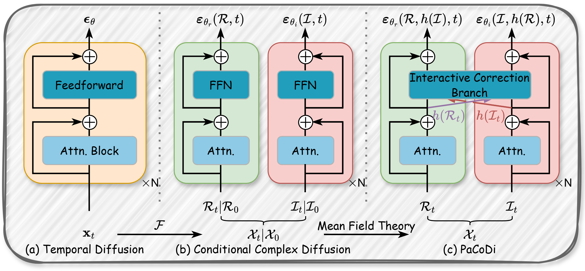

<div align="center">

<h2><b>(KDD'26) Parallel Complex Diffusion for Scalable Time Series Generation</b></h2>

<p>
  
  
  
  
  
</p>

</div>


> 🌊 **PaCoDi** is a **frequency-native diffusion framework** that builds the diffusion path directly in the spectral domain.
> ⚡ It replaces the complex-valued estimator with **parallel real-valued estimators** for the real and imaginary branches, exploits **Hermitian symmetry** to cut **50% of attention FLOPs**, and delivers state-of-the-art generative quality on multiple time-series benchmarks.


## 🗞️ Updates / News

- 🚩 **2026**: **PaCoDi** has been accepted by **KDD '26 V.2**!
- 🚩 **2026**: Official PyTorch implementation, configs, and reproducible launch scripts released.


## 💫 Introduction

Diffusion models learn data distributions indirectly through denoising, so generative difficulty is closely tied to the dependency structure of the data. For time series, strong temporal dependence forces the noise / score estimator to recover highly entangled cross-time relationships — the *curse of entanglement*.

We mitigate this burden by changing the topology of the diffusion space. The Discrete Fourier Transform (DFT) decomposes temporal dependencies into spectral modes, diagonalizing the second-order dependency structure and better aligning the data manifold with isotropic Gaussian noise. However, existing frequency-aware diffusion methods only use the DFT to design estimator blocks under temporal DDPM/SDE frameworks; frequency-native diffusion paths face a mathematical barrier from complex-valued dynamics.

**PaCoDi** (**Pa**rallel **Co**mplex **Di**ffusion) is a frequency-native diffusion framework that constructs the diffusion path in the spectral domain while replacing the complex-valued estimator with parallel real-valued estimators for the real and imaginary components.

<div align="center">
  
</div>

> From **(a)** temporal diffusion on $x_t$, to **(b)** conditional complex diffusion in the spectral domain $\mathcal{X}_t$ via the Fourier transform $\mathcal{F}$, to **(c)** PaCoDi: a *Mean Field Theory* approximation splits the complex estimator into parallel real ($\mathcal{R}$) and imaginary ($\mathcal{I}$) branches, coupled through an *Interactive Correction Branch*.

- **Theory.** We prove the statistical orthogonality of spectral Gaussian noise, establish *quadrature forward transitions* and *conditional reverse factorization*, and extend discrete PaCoDi to continuous-time spectral SDEs through a *Spectral Wiener Process*.
- **Architecture.** A *Mean Field Theory* approximation with an *Interactive Correction Branch* handles marginal coupling between the real and imaginary spectral components.
- **Efficiency.** Hermitian symmetry reduces **50% of attention FLOPs** without any information loss.
- **Results.** Superior generative quality and computational efficiency against 5 SOTA baselines across 5 benchmarks for both unconditional and conditional time-series generation.

Key components:

- **PaCoDi-SDE** (`models/pacodi/pacodi_sde.py`) and **PaCoDi-DDPM** (`models/pacodi/pacodi_ddpm.py`): the continuous-time SDE and discrete DDPM realizations.
- **DiTSolverV1** (`models/pacodi/dit_solver_v1.py`): parallel real/imaginary DiT backbone with an optional concat-based interaction path.


## 📑 Datasets

PaCoDi uses two dataset families: one for **unconditional generation** and
one for **conditional (text-guided) generation**.

### Unconditional generation

Ready-to-use `.npy` assets ship under `data/datasets/`:

| Category | Datasets |
| --- | --- |
| Energy / industrial | `etth1`, `etth2`, `ettm1`, `ettm2`, `electricity`, `energy` |
| Finance | `stocks`, `exchange` |
| Environment | `air`, `weather` |
| Energy market | `be`, `de`, `fr` |
| Scientific | `sines`, `fmri`, `fmri_sim1`–`fmri_sim4`, `eeg` (+ `eeg_label`) |

To rebuild the `.npy` files from raw sources, use:

```bash
python scripts/data/prepare_npy_datasets.py
```

To regenerate the fixed synthetic sine dataset:

```bash
python scripts/data/generate_sines_dataset.py
```

### Conditional generation — TSFragment-600K

Conditional generation builds on the **TSFragment-600K** text–time-series
multi-modal dataset released with [T2S (IJCAI'25)](https://github.com/WinfredGe/T2S).
We re-use the per-domain `embedding_cleaned_*_24.csv` files, which contain the
window length, natural-language description, text embedding, and aligned
series for each fragment.

Download the dataset from Hugging Face and place the required CSV files under
`data/TSFragment-600K/` (sibling of `data/datasets/`):

```bash
# Option 1: HuggingFace CLI
huggingface-cli download WinfredGe/TSFragment-600K --repo-type dataset \
  --local-dir data/TSFragment-600K --local-dir-use-symlinks False

# Option 2: Python API
python - <<'PY'
from datasets import load_dataset
load_dataset("WinfredGe/TSFragment-600K", cache_dir="data/TSFragment-600K")
PY
```

After download, the directory should look like:

```text
data/
├─ datasets/                              # unconditional .npy assets
│  ├─ etth1.npy
│  └─ ...
└─ TSFragment-600K/                       # conditional CSV assets
   ├─ embedding_cleaned_ETTh1_24.csv
   ├─ embedding_cleaned_ETTh1_48.csv
   ├─ embedding_cleaned_ETTh1_96.csv
   ├─ embedding_cleaned_electricity_24.csv
   ├─ embedding_cleaned_electricity_48.csv
   ├─ embedding_cleaned_electricity_96.csv
   └─ ...                                 # other domains and window lengths
```

Each CSV is named `embedding_cleaned_<dataset>_<window>.csv`, where
`<dataset>` is the source time-series domain (e.g. `ETTh1`, `electricity`,
`airquality`, `exchangerate`) and `<window>` is the target generation length
(`24`, `48`, or `96`). Each file therefore represents one
(dataset × generation length) combination.

Our conditional experiments train on the **entire** TSFragment-600K release —
all domains and all window lengths — so we recommend downloading the full
dataset rather than picking individual CSVs. The released configs under
`config/conditional/` cover five representative `(domain, window=24)`
combinations (`etth1`, `ettm1`, `electricity`, `air`, `exchange`); to
reproduce the rest of the paper-reported numbers, copy one of these YAMLs and
point `name:` at the corresponding `embedding_cleaned_*_<window>.csv` file
(remember to set `seq_length` and `window` to match).


## 🚀 Get Started

### Code Overview

```
PaCoDi
├─ main.py                           # task launcher (train / sample)
├─ evaluate_uncond.py                # unconditional metrics + figures
├─ evaluate_conditional.py           # conditional metrics + figures
├─ config/
│  ├─ unconditional/                 # per-dataset YAML configs
│  └─ conditional/
├─ data/
│  ├─ build_dataloader.py
│  ├─ datasets/                      # *.npy assets
│  └─ dataset_utils/                 # unconditional / conditional datasets
├─ engine/                           # training loop, schedulers, logging
├─ models/
│  ├─ pacodi/
│  │  ├─ pacodi_sde.py               # continuous-time SDE PaCoDi
│  │  ├─ pacodi_ddpm.py              # discrete DDPM PaCoDi
│  │  ├─ dit_solver_v1.py            # parallel real/imaginary DiT
│  │  ├─ backbones.py                # backbone registry
│  │  └─ ...
│  └─ ts2vec/                        # encoder used by Context-FID
├─ scripts/
│  ├─ experiments/                   # train + eval launchers per task
│  └─ data/                          # dataset preparation
└─ utils/                            # metrics, visualization, runtime
```

### ① Installation

Install Python 3.10 (e.g. via Miniconda) and then the required dependencies:

```bash
pip install -r requirements.txt
```

Tested with PyTorch 2.x and a single CUDA GPU.

### ② Prepare Datasets

Pre-built `.npy` files already live in `data/datasets/`. Skip this step if you do not need to regenerate them. To rebuild from source, see [📑 Datasets](#-datasets).

### ③ Train & Sample

**Unconditional generation.** Train one or more (seq_length × backbone) configurations on a single dataset:

```bash
bash scripts/experiments/script_uncond.sh
```

Override the defaults via environment variables, e.g. switch dataset or disable real/imag interaction:

```bash
DATASET_NAME=ettm1 CONFIG_FILE=config/unconditional/ettm1.yaml \
  bash scripts/experiments/script_uncond.sh
REAL_IMAG_INTERACTION=false bash scripts/experiments/script_uncond.sh
```

Or call `main.py` directly:

```bash
python main.py --train --mode uncond \
  --name etth1_seq256_ditv1_it1 \
  --dataset_name etth1 \
  --config_file config/unconditional/etth1.yaml \
  --model_name pacodi_sde

python main.py --mode uncond \
  --name etth1_seq256_ditv1_it1 \
  --dataset_name etth1 \
  --config_file config/unconditional/etth1.yaml \
  --model_name pacodi_sde \
  --milestone 5
```

**Conditional generation.**

```bash
bash scripts/experiments/script_conditional.sh
```

Generated samples, checkpoints, and logs are written to:

```text
experiments/<mode>/<model_name>/<dataset_name>/<name>/samples
experiments/<mode>/<model_name>/<dataset_name>/<name>/checkpoint
experiments/<mode>/<model_name>/<dataset_name>/<name>/log
```

### ④ Evaluate

Compute task-specific metrics on existing checkpoints:

```bash
python evaluate_uncond.py
python evaluate_conditional.py
```

Reported metrics include Context-FID, cross-correlation score, discriminative score, predictive score, and Wasserstein distance plus runtime statistics. Per-experiment `metrics.csv` and dataset-level `total.csv` are written alongside the diagnostic figures (`vis_density.png`, `vis_pca.png`, `vis_tsne.png`, …).


## 📈 Quick Reproduce

1. Install Python 3.10 and the dependencies in `requirements.txt`.
2. Download the unconditional `.npy` assets into `data/datasets/` and (optionally) the TSFragment-600K CSVs into `data/TSFragment-600K/`.
3. Reproduce one unconditional ETTh1 main-table number:

   ```bash
   bash scripts/experiments/script_uncond.sh
   python evaluate_uncond.py
   ```

4. Check `experiments/uncond/pacodi_sde/etth1/total.csv` for aggregated metrics.


## 🙋 Citation

> If you find this work useful, please consider starring this repository and citing our paper:

```bibtex
@inproceedings{cai2026pacodi,
  title     = {Parallel Complex Diffusion for Scalable Time Series Generation},
  author    = {Cai, Rongyao and Wan, Yuxi and Zhang, Kexin and Jin, Ming and Ge, Zhiqiang and Wen, Qingsong and Liu, Yong},
  booktitle = {Proceedings of the 32nd ACM SIGKDD Conference on Knowledge Discovery and Data Mining (KDD '26)},
  year      = {2026}
}
```


## 🌟 Acknowledgement

Our implementation adapts [Diffusion-TS](https://github.com/Y-debug-sys/Diffusion-TS), [TS2Vec](https://github.com/zhihanyue/ts2vec), [DiT](https://github.com/facebookresearch/DiT), and [T2S](https://github.com/WinfredGe/T2S) as the code base, and has been extensively modified for the spectral-native parallel diffusion setting. We thank the authors for sharing their implementations and related resources.
